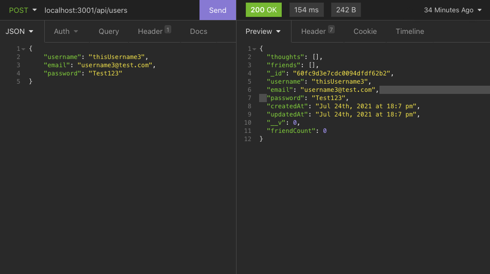
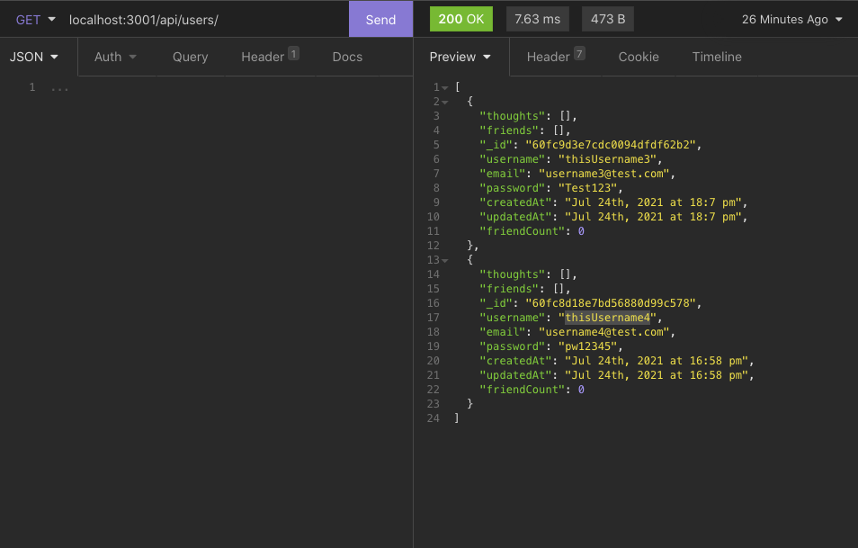
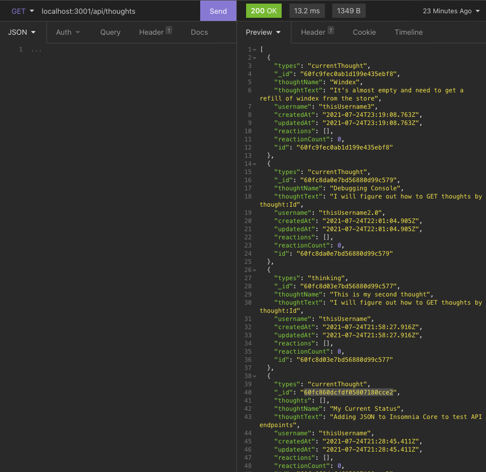
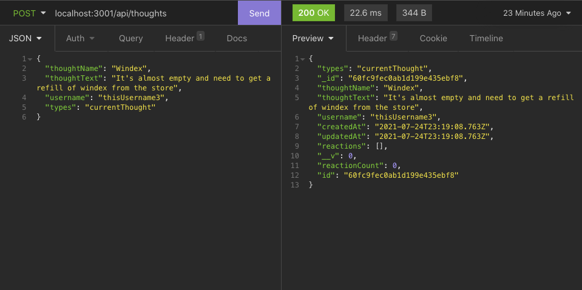

# AfterThought - The Social Network API

## Description
AfterThought is a NoSQL Social Network backend built with Mongoose, MongoDB, and Express.js. AfterThought allows users to create various types of Thoughts; from what they are thinking about for the future ("FutureThought"), what is currently on their mind (CurrentThought), and what are their thoughts about things that have happened (AfterThought). 

Plus, users are able to add, update, and delete reactions to other thoughts, as well as adding and removing friends from their friend list. 

## Functionality

* Created models with Mongoose
* Utilized virtuals to extend model's functionality to account for scalability
* Created subschemas and subdouments with mongoose
* Validated models to normalize data
* Used Bcrypt to encrypt a users password and removed from API calls. 

## Languages
* MongoDB - NoSQL
* Mongoose - Object Data Modeling
* Express.JS
* Node.JS
* Javascript
* HTML
* CSS

## Video Walkthrough
https://www.loom.com/share/a4c398cbdffd4eaf8e02c55921a5f1fa 

## Get Started
* Clone Repository to a desired directory on your computer
* Open directory in your code editor
* npm i to install dependency files
* npm start to start the application

### API Endpoints:
* /api/users
* /api/users/friends
* /api/thoughts
* /api/thoughts/reactions

## Reference Images

